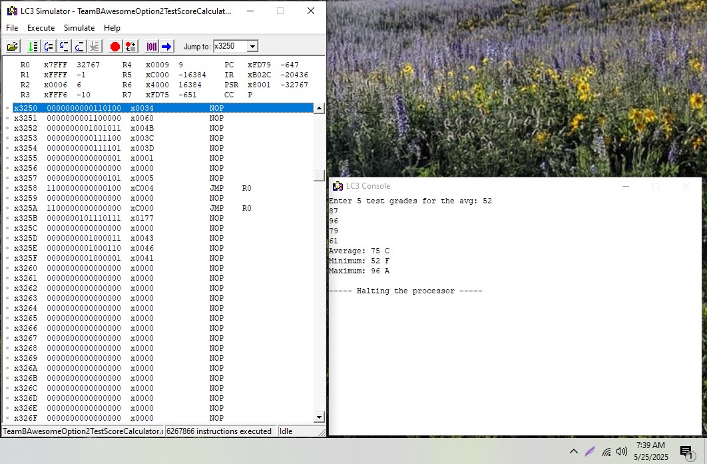

# LC-3-Five-Exam-Averaging-ASM-Program
## Table of contents
* [General Info](#General-info)
* [Collaborators](#Collaborators)
* [Techologies](#Technologies)
* [Setup](#Setup)
* [Usage](#Usage)
* [Minimum hardware requirements](#Minimum-hardware-requirements)
* [Features](#Features)
* [Screenshots](#Screenshots)
* [Project status](#Project-status)
* [Room for improvement](#Room-for-improvement)
* [Release date](#Release-date)
* [Acknowledgements](#Acknowledgements)
* [Sources](#Sources)
* [Contact](#Contact)
* [Improve Readme](#Improve-Readme)

## General info
A program written in LC-3 assembly language for averaging five exam scores and displaying the minimum, maximum, average, and their corresponding letter grade.
This is the course group project for CIS-11: Computer Architecture and Organization, taught at Moreno Valley College by Dr. Kasey Nguyen, PhD.

## Collaborators
- Jason Ash, Computer Science Major
- Ana Moreno, Computer Programming Major
- Luis Lopez-Gallegos, Electrical Engineering Major

## Technologies:
- LC-3 assembly language and the LC-3 editor and simulator (see below):

## Setup
Running the .asm assembly language file requires the LC-3 (Little Computer 3) Simulator created by Yale N. Patt and Sanjay J. Patel.
It can be downloaded at https://highered.mheducation.com/sites/0072467509/student_view0/lc-3_simulator.html
1. Open the .asm file in LC3Edit.exe (version 3.0.0.0)
2. Click on Translate --> Assemble.
3. This will create .obj and other associated files.
4. Open the Simulate.exe program (version 3.01.0)
5. Make sure the console window is visible in addition to the simulator, because often the console window opens minimized or behind other windows when launching the simulator.
6. If you had a previous program running in the simulator, click on File --> Reinitialize Machine to reset it to default values.
7. Click on File --> Load Program and choose the .obj file created by the assembler in LC3edit.
8. Click on Execute --> Run

Alternatively, you can use the online assembler and simulator at https://wchargin.com/lc3web/
1. Click on the Assemble button at the bottom of the Webpage.
2. Copy and paste the source code into the pop-up textbox that appears, or drag and drop the .asm file into that textbox.
3. Click on the Assemble button in that pop-up window.
4. If successful, a message that says, "Awesome! Your code was assembled successfully. You can load your program directly into the simulator, or download the output object file and symbol table." should display.
5. Click the blue Load into Simulator button to automatically load the .obj file into the online simulator.
6. Click on run.
7. Click into the Console and enter five test scores.
8. Note: The typing cursor will not show in the Console section of the Webpage, but have faith that it is there and your keystrokes will be processed as usual.
9. Running the program through the Web-based simulator also results in it taking a slight performance hit and being slightly laggy.

## Usage
After running the program, enter five test scores between 0 and 100 separated by the Enter key. The minimum, average, and maximum test scores will display in the console with their corresponding letter grade next to them.
(i.e. the standard grading scale: < 60 = F, 60 - 69 = D, 70-79 = C, 80-89 = B, and 90 - 100 = A).

## Minimum hardware requirements
- Although Patt and Patel do not mention which versions of Windows to use with their LC-3 Simulator, the program was developed using these tools running on Windows 10 without any issues.
- Any computer with sufficient processing power, RAM, a monitor made within the past 15-20 years, and an Internet connection to download the .asm file and the LC-3 Simulator should suffice.
- When using the online simulator, the minimum hardware requirements should likewise be very light and comparable to the above requirements for using the simulator on Windows.

## Features
- After the user enters five test scores between 0 and 100, the program displays the average, minimum, and maximum test score along with their corresponging letter grade.
- This program performs input validation, confirming that the test scores do not contain characters that are not digits, they must be between 0 and 100, and they cannot be negative.
- Input on a test score is terminated by the enter or space key or after three consecutive digits have been entered.
- The program automatically halts after displaying the average, minimum, and maximum test scores along with their letter grade.

## Screenshots

## Project status
Completed according to the requirements of the project and released here on GitHub.

## Room for improvement
- Combining the three multiplication and two division subroutines into one subroutine for each that is called by the respective part of the program that needs their return values.
- Rounding the average score according to math rounding rules instead of either rounding up all fractional scores, truncating average scores, or being off-by-one on the average score.
- Handling fractional scores with decimal values since the LC-3 has no floating point support and only processes integers.
- Asking the user how many test scores they want to enter to average or averaging test scores for an entire class (both of which are beyond the scope of this project).

## Release date
This project will be launched by June 12, 2025.

## Acknowledgements
Dr. Kasey Nguyen is our project advisor.

## Sources
- Computer architecture and organization and LC-3 assembly language programming are explained in the textbook:
Patt, Yale, and Patel, Sanjay. Ise Introduction to Computing Systems: From Bits & Gates to C. 3rd ed., 	McGraw-Hill, 	2020.
- “What Is a Swimlane Diagram?” Lucidchart, 8 May 2025, www.lucidchart.com/pages/tutorial/swimlane-diagram#:~:text=A%20swimlane%20diagram%20is%20a,employee%2C%20work%20group%20or%20department 

## Contact
Jason Ash - wizardofki@gmail.com
